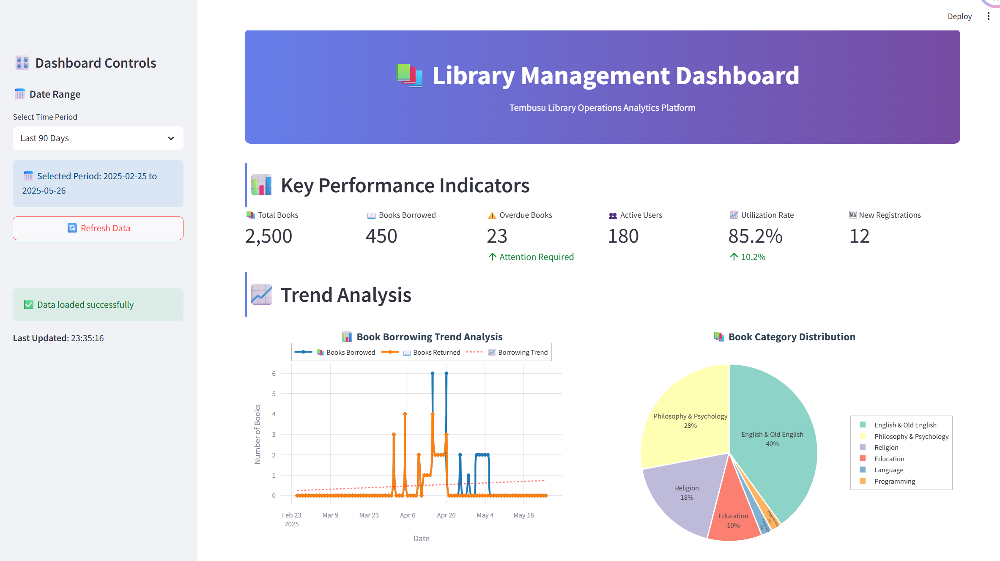
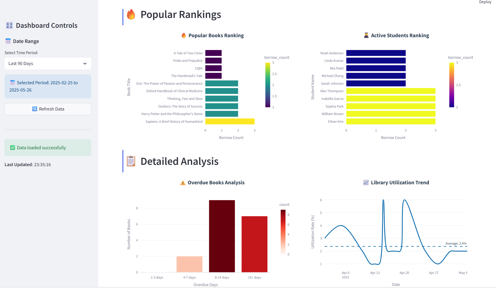

# Smart Library Management System


## Tech Stack

- Python 3.13
- FastAPI
- PostgreSQL

## Quick Start

1. Create a virtual environment:
```bash
python -m venv venv
source venv/bin/activate  # Linux/Mac
.\venv\Scripts\activate   # Windows
```

2. Install dependencies:
```bash
pip install -r requirements.txt
```

3. **Initialize the database** (optional, for first-time setup or reset):
```bash
python scripts/db_init.py reset
```
- Clean data only: `python scripts/db_init.py clean`
- Initialize only: `python scripts/db_init.py init`

4. **Start the FastAPI backend service:**
```bash
uvicorn app.main:app --reload
```
The service will start at: http://localhost:8000

5. **Start the Streamlit dashboard:**
```bash
streamlit run admin_dashboard/main.py
```


## API Documentation

After starting the service, you can access the API documentation at:
- Swagger UI: http://localhost:8000/docs
- ReDoc: http://localhost:8000/redoc


## Dashboard Screenshots

The Streamlit dashboard looks like this:





